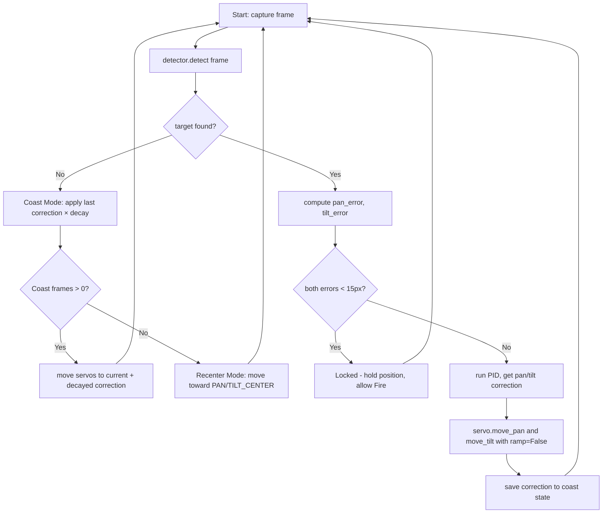

# 15. תיעוד הפתרון

הפרק מכיל את התיעוד הטכני שדורש המחוון: שרטוט חשמלי, חיבורים ואופן הפעולה, קטעי קוד עיקריים, תרשים זרימה, תרשים פונקציונאלי, התייחסות למערכת ההפעלה, והתייחסות לאבטחת מידע. הכל מעוגן בקוד וב־wiring האמיתי בפרויקט.

## 15.1 שרטוט חשמלי

שרטוט מלא של המערכת מופיע ב־[`bookv3/diagrams/electrical-schematic.svg`](../diagrams/electrical-schematic.svg) (הגרסה המפורטת בסגנון הסכמטיקה הקלאסית) ובגרסת מרמייד פשוטה יותר ב־[`bookv3/diagrams/full-schematic.mmd`](../diagrams/full-schematic.mmd). הכותרת המקוצרת: שלוש מסילות כוח (12V מהקיר, 5V לוגיקה מ־USB-C של ה־Pi, 5V סרוו מ־LM2596), אדמה משותפת, ושני מעגלי בקרה (I²C ל־PCA9685 ו־GPIO18 ישירות למודול הלייזר).

### על הפישוט של מעגל הלייזר

הגרסה הסופית של מעגל הלייזר היא **חיבור ישיר של GPIO18 למודול הלייזר 3V** — שני חוטים, ללא רכיבים חיצוניים. המודול עצמו כולל דרייבר פנימי, נגד מגביל זרם פנימי, וייצוב מתח קטן. ה־3.3V של GPIO HIGH מספיקים להפעיל אותו ישירות. הצריכה (~12mA) בתחום הבטוח של GPIO יחיד.

התכנון הראשוני כלל מעגל low-side עם MOSFET (IRLZ44N) ושלושה נגדים (220Ω על Gate, 100kΩ pulldown, 100Ω מגביל זרם), אספקה של 5V דרך פין 4. המעגל נבנה במלואו והקוד נכתב — אבל הדיודה הראשונה הייתה מתה (ראה [`problems/002-laser-dead.md`](../../problems/002-laser-dead.md) לדיאגנוסטיקה). הזמנו חליפה, והפעם בחרנו במודול עם דרייבר פנימי במקום בדיודה חשופה. עם המודול, ה־MOSFET והנגדים הפכו מיותרים. הקוד נשאר זהה — `gpiozero.LED(18).on()` עובד אותו דבר עם MOSFET או בלעדיו.

## 15.2 חיבורים ואופן הפעולה

מטריצת הפינים על Pi GPIO header (40 פינים):

| פין | סיגנל | יעד | תפקיד |
|:-:|---|---|---|
| 1 | 3.3V | — | לא בשימוש |
| 2 | 5V | PCA9685 VCC | אספקת לוגיקה |
| 3 | GPIO2 (SDA) | PCA9685 SDA | I²C נתונים |
| 4 | 5V | — | לא בשימוש (היה לפני הסרת ה־MOSFET) |
| 5 | GPIO3 (SCL) | PCA9685 SCL | I²C clock |
| 6 | GND | PCA9685 GND | אדמה משותפת |
| 9 | GND | Laser BLACK (−) | אדמת הלייזר |
| 12 | GPIO18 | Laser RED (+) ישירות | בקרת לייזר + אספקה ב־3.3V |

חיבורי PCA9685:

| פין | יעד | תפקיד |
|---|---|---|
| VCC | Pi pin 2 (5V) | לוגיקה |
| V+ | LM2596 output (+) | כוח סרוו |
| GND | Pi pin 6 + LM2596 (-) | אדמה משותפת |
| SDA | Pi pin 3 | I²C נתונים |
| SCL | Pi pin 5 | I²C clock |
| Ch 0 | DS3225 פאן | פולס PWM ל־pan |
| Ch 1 | DS3225 טילט | פולס PWM ל־tilt |

חיבורי IRLZ44N MOSFET (TO-220, מבט קדמי, רגליים למטה):

| רגל | תפקיד | יעד |
|---|---|---|
| 1 (Gate) | קלט לוגי | Pi GPIO18 דרך 220Ω, + 100kΩ pulldown ל־GND |
| 2 (Drain) | מתג | קצה שלילי של הלייזר |
| 3 (Source) | אדמה | GND משותפת |

## 15.3 קטעי קוד עיקריים

### `servo.py` — פונקציית המעבר הראשית

```python
def move_pan(kit: ServoKit, angle: float, ramp: bool = True) -> float:
    global _pan_current
    if _pan_current is None:
        raise RuntimeError("servo.init() must be called before move_pan()")

    clamped = max(PAN_MIN, min(PAN_MAX, angle))
    if clamped != angle:
        log.warning("Pan request %.1f° clamped to %.1f°", angle, clamped)

    if ramp:
        _pan_current = _ramp(kit, PAN_CHANNEL, _pan_current, clamped)
    else:
        kit.servo[PAN_CHANNEL].angle = clamped
        _pan_current = clamped
    return _pan_current
```

ה־clamp ב־`max(PAN_MIN, min(PAN_MAX, angle))` הוא הגנת הבטיחות היחידה של המערכת. בלעדיו, באג ב־PID או טעות בקלט יכול להוביל לשבירת הברקט. הפרמטר `ramp` קובע אם תנועה חלקה (ל־כיול) או מיידית (ללולאת מעקב — כדי לא לחסום).

### `detector.py` — pipeline הזיהוי המלא

```python
def detect(frame: np.ndarray) -> Optional[Tuple[int, int]]:
    mask = build_mask(frame)
    contours, _ = cv2.findContours(
        mask, cv2.RETR_EXTERNAL, cv2.CHAIN_APPROX_SIMPLE
    )
    if not contours:
        return None
    largest = max(contours, key=cv2.contourArea)
    if cv2.contourArea(largest) < config.MIN_CONTOUR_AREA:
        return None
    moments = cv2.moments(largest)
    if moments["m00"] == 0:
        return None
    cx = int(moments["m10"] / moments["m00"])
    cy = int(moments["m01"] / moments["m00"])
    return cx, cy
```

`build_mask` (לא מוצג כאן) מבצע blur → BGR→HSV → inRange → erode → dilate. הקוד שלעיל בוחר את הקונטור הגדול ביותר, מסנן קונטורים זעירים מתחת ל־`MIN_CONTOUR_AREA = 200`, ומחזיר את מרכז המסה דרך image moments. בכל אחד מהמצבים שבהם אין מטרה — אין קונטור, קונטור קטן מדי, או קונטור מנוון — מוחזר `None`.

### `tracker.py` — לולאת ה־PID + Coast

```python
def update(pan_pid, tilt_pid, kit, target_pos):
    global _last_pan_correction, _last_tilt_correction, _coast_frames_remaining

    if target_pos is None:
        # Coast: continue applying last correction if it was meaningful
        last_was_meaningful = (
            abs(_last_pan_correction) >= config.COAST_MIN_CORRECTION_DEG
            or abs(_last_tilt_correction) >= config.COAST_MIN_CORRECTION_DEG
        )
        if _coast_frames_remaining > 0 and last_was_meaningful:
            servo.move_pan(kit, servo.current_pan() + _last_pan_correction, ramp=False)
            servo.move_tilt(kit, servo.current_tilt() + _last_tilt_correction, ramp=False)
            _last_pan_correction *= config.COAST_DECAY
            _last_tilt_correction *= config.COAST_DECAY
            _coast_frames_remaining -= 1
            return {"coasting": True, ...}
        return None

    target_x, target_y = target_pos
    pan_error = target_x - config.FRAME_CENTER_X   # 320
    tilt_error = target_y - config.FRAME_CENTER_Y  # 240

    pan_correction = pan_pid(pan_error)
    tilt_correction = tilt_pid(tilt_error)

    if abs(pan_error) < config.TRACKING_DEADBAND_PX \
       and abs(tilt_error) < config.TRACKING_DEADBAND_PX:
        return {"in_deadband": True, ...}

    servo.move_pan(kit, servo.current_pan() + pan_correction, ramp=False)
    servo.move_tilt(kit, servo.current_tilt() + tilt_correction, ramp=False)
    _last_pan_correction = pan_correction
    _last_tilt_correction = tilt_correction
    _coast_frames_remaining = config.COAST_MAX_FRAMES
    return {...}
```

הלוגיקה: אם המטרה אבדה ("target_pos is None"), נכנסים ל־Coast Mode בהנחה שהתיקון האחרון היה משמעותי. אם המטרה נמצאת, חישוב error מפיקסל, חישוב correction מ־PID, ובדיקה אם נמצאים ב־Deadband (לא נעים). אחרת — שולחים פקודת תנועה ושומרים את התיקון כ־state לפעם הבאה.

### `laser.py` — שלוש פונקציות פשוטות

```python
def init() -> LED:
    laser_dev = LED(LASER_PIN)  # GPIO18
    laser_dev.off()  # explicitly OFF on startup
    log.info("Laser initialized on GPIO%d (OFF)", LASER_PIN)
    return laser_dev

def fire(laser_dev: LED) -> None:
    laser_dev.on()
    log.info("Laser ON")

def cleanup(laser_dev: LED) -> None:
    try:
        laser_dev.off()
    except Exception:
        log.exception("Error driving laser pin LOW during cleanup")
    laser_dev.close()
    log.info("Laser cleanup complete")
```

הקוד פשוט עד כדי כך כי גם הספרייה `gpiozero` עוטפת את כל המורכבות. `LED(18)` מגדיר את GPIO18 כפלט, `off()` מורידה אותו, `on()` מעלה. ה־`cleanup` קריטי בכל script שמשתמש בלייזר — חייב לרוץ ב־`finally`.

## 15.4 תרשים זרימה — לולאת המעקב



## 15.5 תרשים פונקציונלי

תרשים פונקציונלי (Functional Diagram) מתאר את זרימת הסיגנלים בין רכיבי המערכת. גרסת המרמייד המלאה ב־[`bookv3/diagrams/functional-diagram.mmd`](../diagrams/functional-diagram.mmd). תקציר טקסטואלי:

המצלמה מספקת זרם וידאו (640×480 BGR @ 30 fps) דרך USB ל־Pi. ה־Pi מריץ את `detector.detect()` שמפיק קואורדינטה `(cx, cy)` של מרכז המטרה. ה־tracker מחשב error בפיקסלים, מזין לבקרי PID, ומקבל correction בזוויות. הקורקציה מועברת ל־`servo.py`, שמתרגמת לפקודות I²C על אפיק bus 1, יעד `0x40` (PCA9685). ה־PCA9685 מתרגם את הפקודה לפולסי PWM 50Hz על ערוצים 0 (פאן) ו־1 (טילט). הפולסים מגיעים לסרוואי DS3225 שמזיזים את הברקט. תנועת הברקט מזיזה גם את המצלמה (כי היא מקובעת על לוחית הטילט) — והפריים הבא יראה את המטרה במיקום חדש, סוגר את הלולאה. במקביל, GPIO18 שולט בלייזר דרך MOSFET. הזרימה אוטונומית עד שהמפעיל לוחץ Fire ב־GUI.

## 15.6 התייחסות למערכת ההפעלה

המערכת רצה על **Raspberry Pi OS 64-bit (Bookworm)**, וריאנט של Debian 12. הקרנל הוא 6.x, ה־Python הראשי הוא 3.11. שירותי OS שאנחנו מסתמכים עליהם:

- **`uvcvideo` (קרנל)** — דרייבר מצלמת USB. נטען אוטומטית כשמחברים מצלמת UVC. ללא קונפיגורציה.
- **`i2c-bcm2835` (קרנל)** — דרייבר I²C על אפיק 1. מופעל דרך `raspi-config` → Interface Options → I2C → Enable, או ידנית ב־`/boot/config.txt` עם `dtparam=i2c_arm=on`.
- **`/dev/gpiomem`** — קובץ המכשיר ש־gpiozero כותב אליו לבקרת GPIO18.
- **`cron`** — מתזמן משימות. job אחד בו: `* * * * * cd ~/pi && git pull > /dev/null 2>&1` — מבצע `git pull` כל דקה.
- **`systemd`** — לא משתמשים בו ספציפית, אבל כל ה־OS מנוהל על ידו (כולל ה־VNC server, ה־SSH server, ושירותי הרשת).

המערכת לא דורשת שירותים מיוחדים — אין daemon שלנו ב־systemd, אין port פתוח, אין שירות שרץ ברקע. כל מה שאנחנו מריצים זה תהליך Python אחד שהמפעיל פותח דרך VNC (control panel) או SSH (test scripts).

## 15.7 התייחסות לאבטחת מידע

המערכת לא שומרת מידע פרטי, לא מתחברת לאינטרנט בזמן ההפעלה, ולא מקבלת ציוויים מבחוץ. אבל יש כמה נקודות שראוי להתייחס אליהן:

**גישה ל־Pi** מתבצעת רק דרך SSH ו־VNC, שתיהן מוגנות בסיסמת ה־user `adam` שנקבעה ב־`raspi-config`. הסיסמה לא ברורה (10+ תווים, ערבוב של אותיות וספרות), והשירותים האלה זמינים רק ברשת הביתית — לא חשופים לאינטרנט. **המאגר** ב־GitHub ציבורי (כל הקוד פתוח לבחינה), אבל לא מכיל מידע רגיש (אין סיסמאות hard-coded, אין tokens של API). הקובץ `.env` ש־git מתעלם ממנו (`.gitignore`) ריק — אנחנו לא צריכים secrets.

**הלייזר** הוא שיקול בטיחות יותר מאשר אבטחת מידע, אבל ראוי להזכיר: הלייזר מתעורר רק בלחיצת אישור של המפעיל ב־GUI, ויש דיאלוג אישור נוסף לפני הירי. בשום מצב הלייזר לא יכול להופעל אוטונומית מהקוד. ה־pulldown של 100kΩ מבטיח שגם אם הקוד קורס, הלייזר נכבה. הלחצן Emergency Stop ב־control panel מורד את GPIO18 ל־LOW מיד.

**צפייה במצלמה מרחוק** דרך VNC כן אפשרית — כל מי שיש לו את הסיסמה של ה־Pi רואה את הפריים בזמן אמת. אם הפרויקט יוצב ביישום שבו הפרטיות חשובה (למשל מעקב בכיתה), חשוב לדעת זאת. בפרויקט הנוכחי, כל המעקב מתבצע על מטרה דוממת (שקית כחולה), אז זה לא מהווה בעיה.
