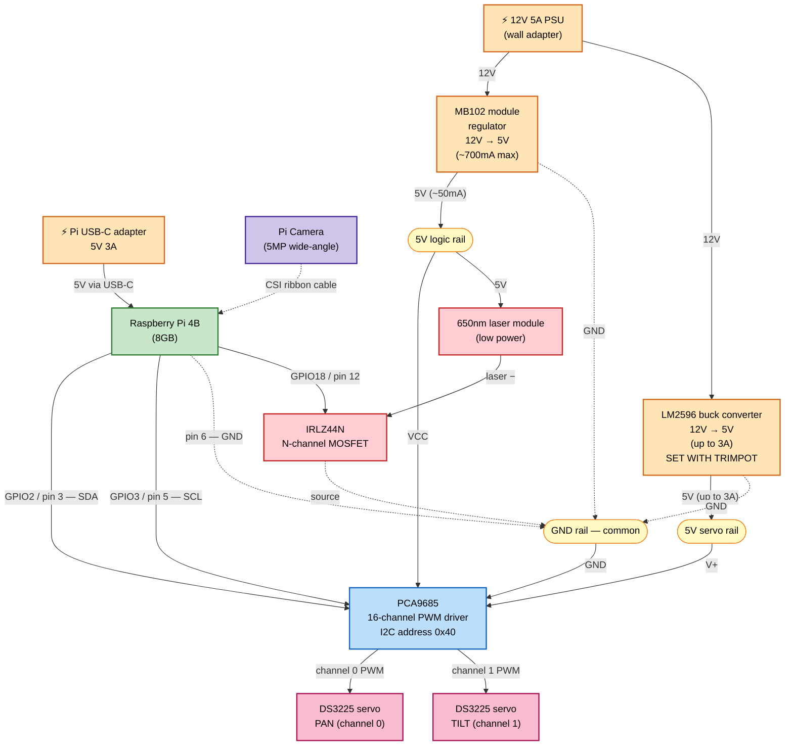
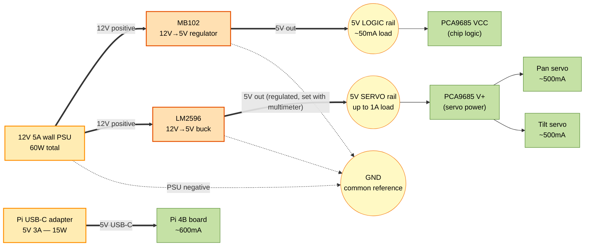
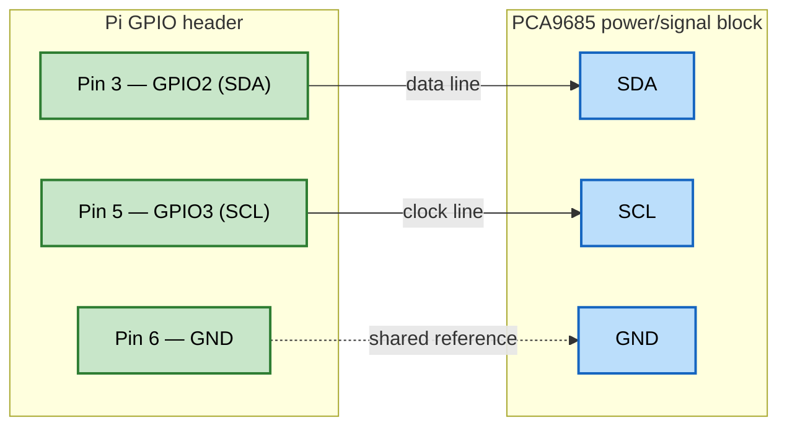
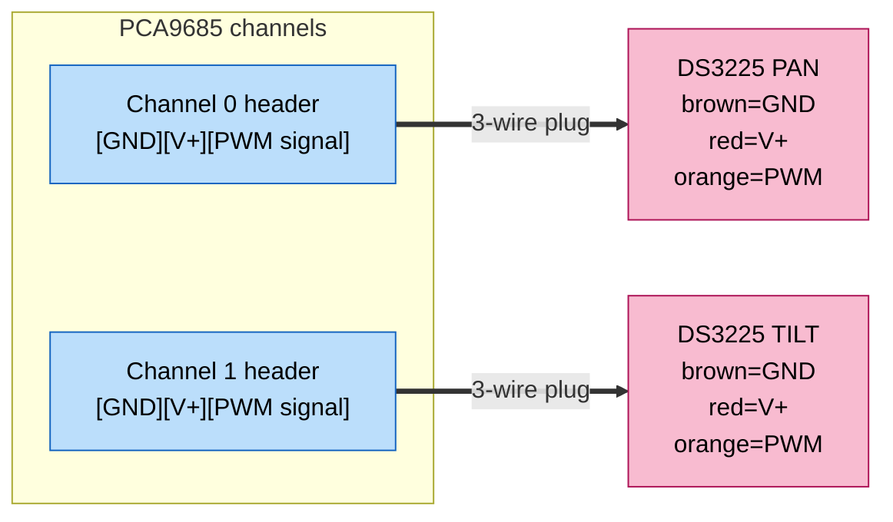
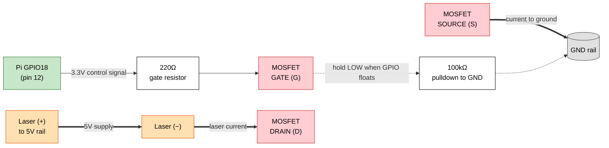
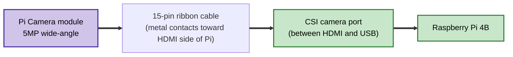
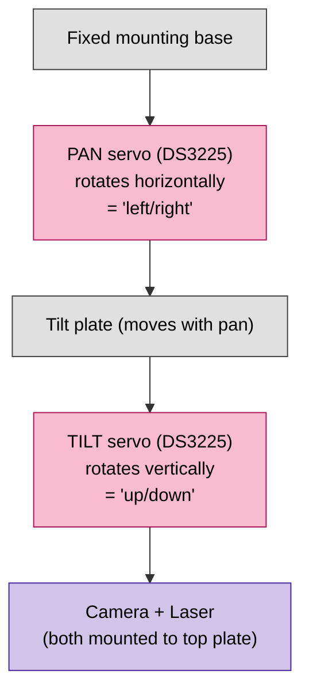

# Laser Tracker — Circuit Diagram

Diagrams below use **Mermaid**, which GitHub renders as real visual diagrams.
View this file on GitHub (or in any Markdown viewer with Mermaid support) to see
the rendered graphics. If you only see code blocks, your viewer doesn't support
Mermaid — open the file on github.com instead.

---

## 1. System overview

Everything in one picture — what connects to what.



---

## 2. Power distribution (where each Amp comes from)

Two power domains, both grounded to a common rail.



**Why two regulators for the same 5V?**
The MB102 can't supply enough current for the servos. The LM2596 takes the same
12V source but uses a switching design that can supply 3A. By splitting the rails,
the servo current spikes can never affect the chip logic or the Pi.

---

## 3. I2C signal path (Pi ↔ PCA9685)

Just three wires from the Pi to the PCA9685 carry all servo commands.



**Note:** SDA and SCL only need pull-up resistors if the PCA9685 board doesn't
already have them onboard. Most Adafruit-compatible breakout boards include them —
no external pull-ups needed for this project.

---

## 4. Servo connections (PCA9685 → DS3225)

Each servo plugs into a 3-pin header on the PCA9685. The PCA9685 routes
GND / V+ / Signal automatically per channel.



**Wire colors on DS3225:**
- Brown = GND
- Red = V+ (5V from PCA9685 V+ rail)
- Orange (or yellow) = PWM signal from PCA9685

Plug orientation matters. The PCA9685 silkscreen shows which pin is GND on each header.

---

## 5. Laser switching circuit (GPIO18 → MOSFET → laser)

The GPIO pin doesn't power the laser directly. It opens/closes a MOSFET
which acts as a switch.



**How it works (in plain English):**

1. The 220Ω resistor between GPIO18 and the MOSFET gate limits current into
   the gate if the pin floats — protects the Pi.
2. The 100kΩ resistor between gate and GND **pulls the gate low** whenever
   GPIO18 is not actively driving high. Without this, the gate could float
   to an unknown voltage at boot and the laser could turn on unintentionally.
3. When the Pi sets GPIO18 HIGH (3.3V), the gate voltage rises, the MOSFET
   conducts between drain and source, and current flows through the laser
   to GND → laser turns ON.
4. When the Pi sets GPIO18 LOW (0V), the gate is pulled back low by the 100kΩ,
   the MOSFET stops conducting, and the laser turns OFF.

**IRLZ44N pinout (TO-220 package, flat face toward you, leads down):**

```
       ┌─────────┐
       │  IRLZ44N│
       │  metal  │
       │   tab   │
       └────┬────┘
            │
       ┌────┴────┐
       │ G  D  S │   ← pins, left to right when flat face is toward you
       └─┬──┬──┬─┘
         │  │  │
         G  D  S
         │  │  │
       [220Ω] │  └── to GND rail
         │   │
      GPIO18 │
            └── laser (−)
```

---

## 6. Camera connection (informational)

The Pi Camera plugs into the Pi's CSI port via a flat ribbon cable.
**Not connected to the breadboard at all.**



The camera is mounted to the tilt plate of the pan-tilt bracket so that when
the servos move, the camera's view moves too.

---

## 7. Mechanical layout (pan-tilt bracket)



The pan servo is at the bottom; it rotates the entire upper assembly left/right.
The tilt servo sits above it and pivots the camera/laser plate up/down.
This is why pan is channel 0 (the "base" axis) and tilt is channel 1.

---

## Legend / color key

| Color | Meaning |
|-------|---------|
| 🟧 Orange | Power source or voltage regulator |
| 🟩 Green | Raspberry Pi 4B and its GPIO pins |
| 🟦 Blue | PCA9685 PWM driver |
| 🟪 Purple | Camera |
| 🟥 Red/Pink | Laser circuit and servos |
| 🟨 Yellow | Shared rails (5V or GND) on the breadboard |

| Arrow style | Meaning |
|-------------|---------|
| `==>` thick arrow | High-current power line |
| `-->` regular arrow | Signal or control line |
| `-.->` dashed arrow | Ground or shared reference |

---

## Notes

- **Common ground is critical.** The Pi, MB102, LM2596, and PCA9685 must all
  share the same GND rail. Without it, I2C will not communicate.
- **The LM2596 must be set to 5.0V before connecting** — see
  [problems/001-servo-power.md](../problems/001-servo-power.md) for procedure.
- **Diagrams reflect the target wiring after problem 001 is resolved.**
  As of right now, the Pi-to-breadboard jumpers are not yet installed
  (Task 3.1 will do that).
